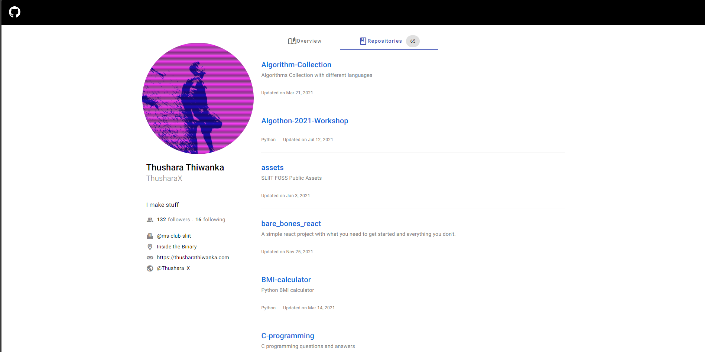

# Github Profile Page

This project was generated with [Angular CLI](https://github.com/angular/angular-cli) version 17.2.0.

## Development server

Run `ng serve` for a dev server. Navigate to `http://localhost:4200/`. The application will automatically reload if you change any of the source files.

## Further help

To get more help on the Angular CLI use `ng help` or go check out the [Angular CLI Overview and Command Reference](https://angular.io/cli) page.

## Projet Overview

Developed an Angular application that displays GitHub user profiles and their repositories.

### Home Page

- Contains a user search field. 
- Enter user name and press enter key
- Users list will be shown, it has server side pagination.

- Results per page is 10 items
- On click of the username, the page navigates to user profile

### Profile Page

- On the left side user profile details is shown
- On the right side user readme file will be shown or else popular repos of the user will be shown limited to 6.
- There are two tabs i.e Overview and Repositories with number of repos the user has, default selected tab is overview.

### Repository Page

- Repository page contains list of public repositories of the user.
- It includes Repo name, description, updated on, repo language, stars and forks.
- Table is designed with server side pagination.

